# Reinforcement learning

## 1. Introduction

​									         **marshmallow test**

Reinforcement Learning (RL) refers to a kind of Machine Learning method that how software agents ought to take *actions* in an *environment* so as to maximize some notion of cumulative *reward*.

It was mostly used in games (e.g. Atari, Mario), with performance on par with or even exceeding humans. Recently, as the algorithm evolves with the combination of Neural Networks to solve more complex problems.

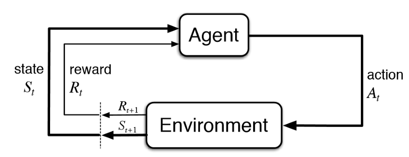

**Q. How can we model decision making process of agents for a environment which have specific characteristics?**

#### Markov decision process

**Markov decision processes** (**MDPs**) provide a mathematical framework for modeling [decision making](https://en.wikipedia.org/wiki/Decision_making) in situations where outcomes are partly [random](https://en.wikipedia.org/wiki/Randomness#In_mathematics) and partly under the control of a decision maker. MDPs are useful for studying a wide range of [optimization problems](https://en.wikipedia.org/wiki/Optimization_problem) solved via [dynamic programming](https://en.wikipedia.org/wiki/Dynamic_programming) and [reinforcement learning](https://en.wikipedia.org/wiki/Reinforcement_learning). (ref : wikipedia)

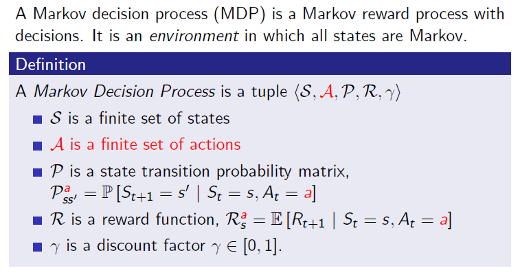

#### Definition

1. Action (A): All the possible moves that the agent can take

2. State (S): Current situation returned by the environment.

3. Reward (R): An immediate return send back from the environment to evaluate the last action.

4. State transition probability matrix

   $$\large P^{a}_{s'} = P[S_{t+1} = s' | S_t = s, A_t = a]$$

   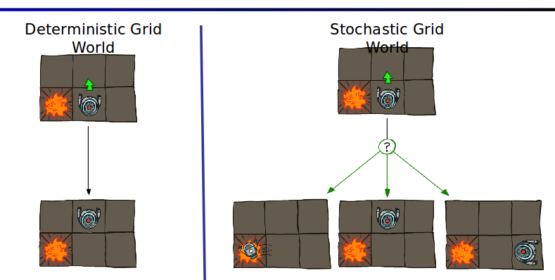

5. Discounting factor ( $$0\le \gamma \le 1 $$)

   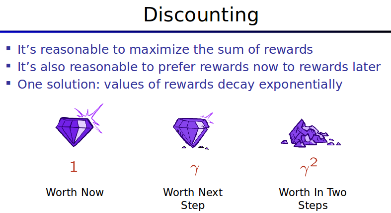

6. Policy (π): The strategy that the agent employs to determine next action based on the current state.

7. state value function (V): The expected long-term return with discount, as opposed to the short-term reward R. $$V\pi(s)$$ is defined as the expected long-term return of the current state sunder policy π.

   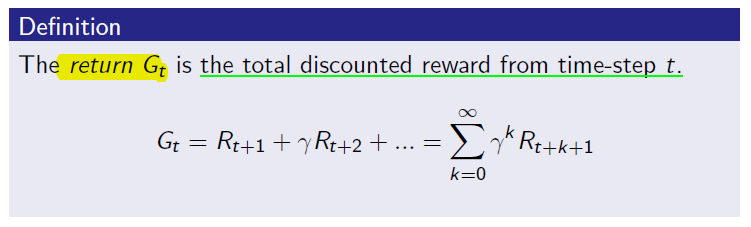

   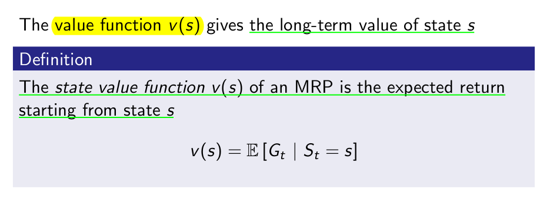

8. Q-value or action-value function (Q): Q-value is similar to Value, except that it takes an extra parameter, the current action *a*. $$Q\pi(s,a)$$ refers to the long-term return of the current state *s*, taking action *a* under policy π.

   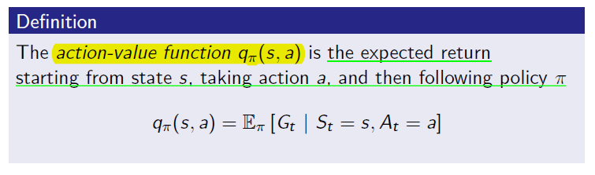

## 2. Q-Learning intro

We are going to explore Q-learning algorithms. Q-learning algorithms are a family of Reinforcement learning. These are a little different with policy-based algorithm. These use look-up table to solve problems.

We will combine Q-learning approaches and policy gradient method to build the state of the art RL agent. This tutorial may be easy and basic but enough to start for going to complex and difficult problems.

both approaches target the goal to choose intelligent action given a situation.

---

**Policy gradient** methods learn a mapping function from an observation to an action( **Observation** $$\rightarrow$$ **Action** ) 

**Q-learning algorithms** learn the value of given state to each action using **look-up tables or networks**.

---

#### 2-1. Dynamic programming

**Dynamic programming breaks a multi-period planning problem into simpler steps at different points in time.** Therefore, it requires keeping track of how the decision situation is evolving over time. **The information about the current situation which is needed to make a correct decision is called the "state"**.

The variables chosen at any given point in time are often called the ***control variables*.**

The **dynamic programming approach describes the optimal plan** by finding a rule that tells what the controls should be, given any possible value of the state. You can see the example of dynamic programming in the below figure.

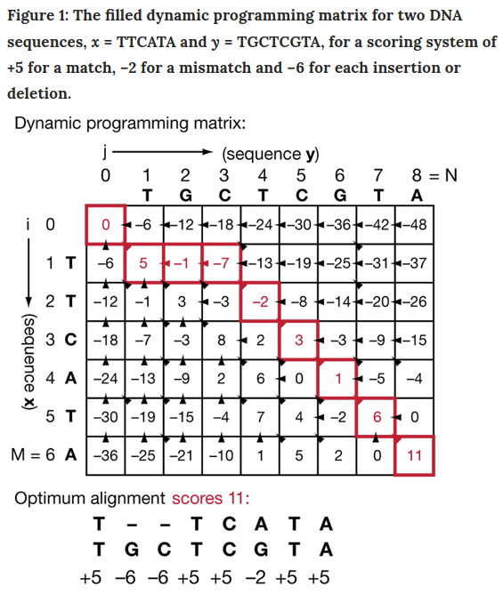

Each cell of the table was filled with a score from a scoring system and pre-states. There were two cases when you scoring from pre-states to a present state. first, optimal case to get the highest score among pre-states. second, a case to take lower score than other case. Of course, you must choose first one.

Consequently, present decision should be done to make optimal as considering both present payoff and the following states.

#### 2-2. Bellman equation

A Bellman equation, named after its discoverer, Richard Bellman, also known as dynamic programming equation. This breaks a dynamic optimization problem into simpler subproblems.

1. A dynamic decision problem

   the current payoff from taking $$a$$ in state $$x$$ is $$F(x, a)$$

   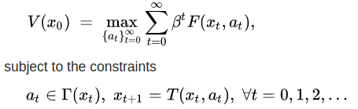

2. Bellman's Principle of optimality

   **Principle of Optimality :** An optimal policy has the property that whatever the initial state and initial decision are, the remaining decisions must constitute an optimal policy with regard to the state resulting from the first decision. 

   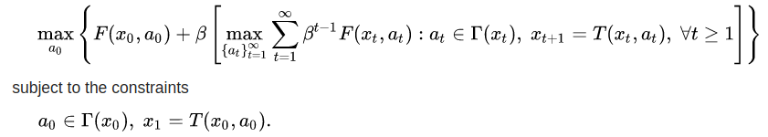

   Choose the action to be considered with not only current payof,f but also rewards of the following states.  

3. The Bellman equation

   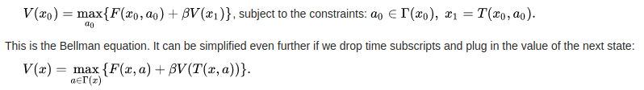

Reference : https://en.wikipedia.org/wiki/Bellman_equation

#### 2-3. "The FrozenLake" game introduction 

The FrozenLake game consists of a 4x4 grid of block, each one being either the starting block, a safe frozen block, the goal block and a dangerous hole block. The objective is to train an agent which can move from the starting block to the goal block, not to fall into any hole. The reward at every step is 0, except for entering the goal, which provides a reward of 1.The agent can move either up, down, left, or right at any time. However, sometimes there is a wind to blow the agent onto a space It did not choose. 

Therefore perfect performance every time is impossible, but we want to design an agent to take **long-term expected rewards**. This is exactly what Q-Learning is designed to provide.

This equation states that the long term expected reward given a action is equal to **combination of the immediate reward from the current action and the expected reward from the best future action taken at following state.**
$$
Q(s, a) = r + ymax( Q(s', a') )
$$
This says that the Q-value for a given state (s) and action (a) should represent the current reward (r) plus the maximum discounted (γ) future reward expected according to our own table for the next state (s’) we would end up in.

​										Q-Learning with a table

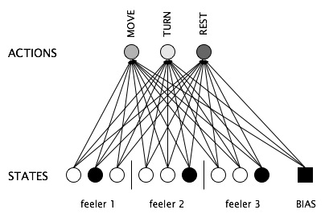

​										Q-Learning with a network

## 3. Policy gradient

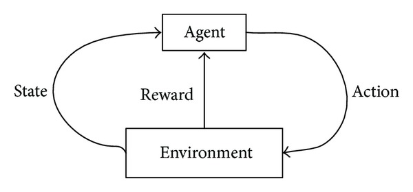

