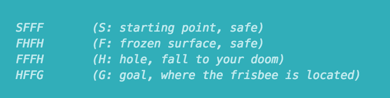

# reinforcement learning

##1. Q learning with tables and neural networks

- policy gradient methods attempt to learn function which directly map an observation to an action.
- Q-Learning attempts to learn the value of being in a given state, and taking a specific action there.
- Deep Q networks are just larger and complex implementations of the Q-Learning algorithm.

The FrozenLake game consists of a 4x4 grid of block, each one being either the starting block, a safe frozen block, the goal block and a dangerous hole block. The objective is to train an agent which can move from the starting block to the goal block, not to fall into any hole. The reward at every step is 0, except for entering the goal, which provides a reward of 1.The agent can move either up, down, left, or right at any time. However, sometimes there is a wind to blow the agent onto a space It did not choose. 

Therefore perfect performance every time is impossible, but we want to design an agent to take **long-term expected rewards**. This is exactly what Q-Learning is designed to provide.

##### 

### Bellman equation

https://en.wikipedia.org/wiki/Bellman_equation

This equation states that the long term expected reward given a action is equal to **combination of the immediate reward from the current action and the expected reward from the best future action taken at following state.**
$$
Q(s, a) = r + ymax( Q(s', a') )
$$
This says that the Q-value for a given state (s) and action (a) should represent the current reward (r) plus the maximum discounted (γ) future reward expected according to our own table for the next state (s’) we would end up in.

# Policy gradient

Reinforcement learning provides the capacity for us not only to teach an artificial agent how to act, but to allow it to learn through it’s own interactions with an environment.

-----------------

Typical aspects of a task that make it an RL problem are the following:

- 1, Different action  ==> Different reward
- 2, Rewards are delayed over time
- 3, Reward for an action is conditional on the state of the environment

----

In N-armed bandit games, We can focus on only first aspect on RL problems, Because These are stateless.

There are n-many slot machines, each with a different fixed payout probability. The goal is to discover the machine with the best payout, and maximize the returned reward by always choosing it.

---

우리가 가능한 action 중 어떤 reward를 선택할 것인가?

그것이 최적인가?

It's about policy and we can learn weights of value function by policy gradient.

 

*This is the another approach to find value functions.* In those approaches, instead of learning the optimal action in a given state, the agent learns to predict how good a given state or action will be for the agent to be in.

-----

### policy gradient loss

Once our agent has taken an action, it then receives a reward of either 1 or -1. With this reward, we can then make an update to our network using the policy loss equation:

`Loss = -log(π)*A 

pi : the policy, A : advantage 